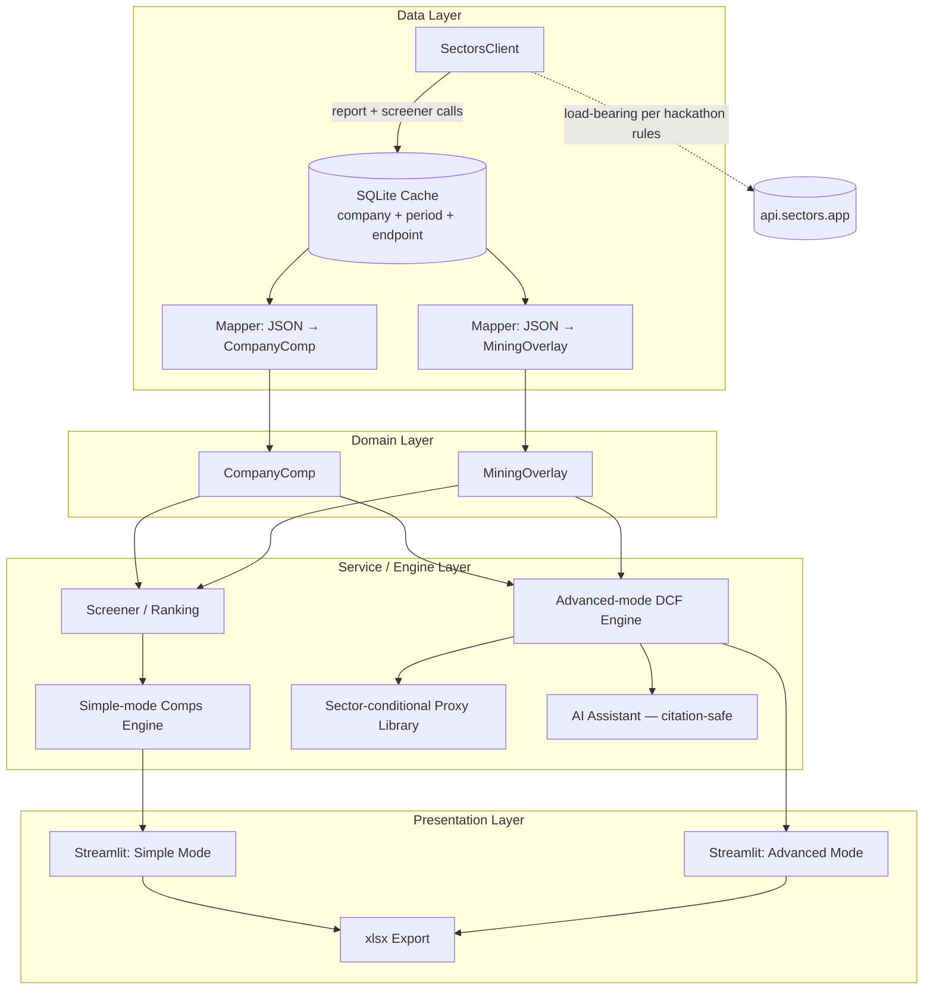

# Mimir — Target Architecture

Complements `systemPatterns.md` (which documents what's *implemented*) with the full
target shape — how the built pieces, the planned pieces, and a few concretely-resolved
open questions fit together. Merge stable sections into `systemPatterns.md` /
`activeContext.md` as they land; treat this as the map, not a second source of truth.

---

## 1. Layered view

Everything below `A` degrades to `None`/excluded, never to a silently-substituted number
— that's the cross-footing discipline enforced structurally, not just at the UI layer.

---

## 2. Data Layer

### `SectorsClient` — one addition needed
`get_company_report` (exists) stays for one-off deep dives: ownership, management,
peers list, dividend history — fields the screener doesn't expose.

**Add a `screen(where=..., order_by=..., limit=...)` method** hitting `/v2/companies/`
(IDX) and `/v2/sgx/companies/` (SGX). This becomes the *primary* path once the screener
layer exists: it returns market_cap, revenue, ebitda, ebit, earnings, pe/pb/ps, and (IDX
only) precomputed `enterprise_to_ebitda`/`enterprise_to_revenue` for an **entire matched
comp set in 1 credit**, versus 1 credit per section per company through `get_company_report`.
For a 10-15 peer comp set that's the whole point of having a credit-metered API — worth
building before the screener layer, not after.

### `SQLiteCache` — settle the `period` convention now
This is explicitly flagged as open in `activeContext.md`, and it should be resolved
before the screener starts pulling many companies, because it's cheap to fix now and
expensive to migrate later. Proposal, based on the actual v2 contract:

| Data kind | `period` value | Why |
|---|---|---|
| Annual financials (IDX/SGX) | fiscal year, e.g. `"2024"` | Matches the API's own `field[2024]` bracket syntax; audited annuals don't change, so this can cache indefinitely. |
| Quarterly (IDX only) | `"Q1-2024"` etc. | SGX has no quarterly data at all — confirmed directly in the docs, not inferred. |
| Point-in-time (market_cap, last_close_price, `overview`/`valuation` sections) | today's ISO date | What's already implemented for the report endpoint — correct for *this* kind of field. |
| Mining overlay (financials, performance, sales-destination) | fiscal year, keyed by **slug** not ticker | Same annual convention, different entity_id namespace. |

The key point: **`period` isn't one convention, it's "the natural period of the
underlying data."** Forcing today's-date onto annual financials (the current fallback,
since the report endpoint has no period param) works today because only BBCA's overview
has been pulled — it'll quietly make every annual figure look "stale after 1 day" once
the cache actually has to decide whether to refetch, defeating the reason to cache annual
data at all. Fix this before the screener multiplies the number of cache rows.

### Mapper (report JSON → `CompanyComp`) — the next concrete build step
Confirmed field mapping from the live v2 `company/report` shape:

- `overview.market_cap` → `market_cap`
- `overview.last_close_price` → `price`
- `financials.historical_financials[year]` → `revenue`, `ebit`, `ebitda`, `earnings`,
  `total_debt`, `cash_and_equivalents`, `total_equity`, `total_liabilities`,
  `outstanding_shares` (pick the entry for the requested/latest year)
- `financials.eps` → `eps`

This previously resolved **Next Step "true P/B" for free** — now *done*: `total_equity`
was right there in `historical_financials[year]`, so `price_to_book` has moved from the
old `market_cap / total_assets` approximation to `market_cap / total_equity` (see
`progress.md`). No separate fix remains.

---

## 3. Domain Layer

### `CompanyComp` — structurally fine as-is, one gap to *expect*, one asymmetry to fix
- **SGX gap**: neither the SGX screener nor the SGX company report exposes `total_debt`
  or `cash_and_equivalents` (confirmed against live docs, and now in
  `learnings-and-principles.md`). The model already handles this correctly — EV falls
  back to `None` — so no code change is required. What *is* worth adding: once mixed
  IDX/SGX comp sets get screened together, a blank EV/EBITDA cell should read as "not
  computable from source data," not "not computed yet." Recommend an explicit
  `exclusion_reasons` entry like `"EV unavailable (SGX data gap)"` rather than leaving it
  indistinguishable from a genuinely missing IDX field — the product's whole
  differentiator is that every gap is explained, not just present.
- **`ev_to_revenue` asymmetry** (flagged by your own Excel cross-check): add
  `"missing revenue"` / `"non-positive revenue"` to `exclusion_reasons`, mirroring the
  existing EBITDA pattern. No reason revenue should be treated differently from EBITDA
  here — this was a gap in the reason list, not a deliberate design choice.

### `MiningOverlay` — new sibling model, not a `CompanyComp` subclass
Separate model because it's sourced from a different namespace (mining.sectors.app
extension, keyed by **slug**, in **USD** not IDR) at a different periodicity
(per-commodity-per-year). Join to `CompanyComp` via ticker↔slug, don't merge the models.

Concrete formulas, from the actual `mining_performance` / `mining_sales_destination`
payload shapes:

| Metric | Formula | Source field |
|---|---|---|
| EV/tonne of reserves | `enterprise_value / total_reserves_Mt` | reuses `CompanyComp.enterprise_value` — don't recompute EV twice |
| EV/tonne of production | `enterprise_value / production_volume` | same |
| Reserve life (years) | `total_reserves_Mt / production_volume` | at current production rate |
| Export concentration | HHI (or max-share) over `percentage_of_sales_volume` by country | `mining_sales_destination`, company-level — not the national-aggregate export endpoint, which is the wrong granularity |

Two design notes worth deciding now rather than mid-build:
- **Multi-commodity miners**: `mining_performance` returns one array entry per commodity.
  Recommend **one `MiningOverlay` instance per commodity**, not a blended average — EV
  per tonne is economically meaningless mixed across e.g. coal and gold.
- **Self-reported flag**: the API has no audit-status field, so set this `True`
  unconditionally rather than trying to infer it — it's structurally true for every row,
  not a per-company judgment call.
- **Reserve vintage flag**: `resources_reserves.measurement_year` already exists in the
  payload — use it directly as the vintage flag rather than inventing new metadata. This
  closes the open item in `systemPatterns.md` pattern #9.

---

## 4. Service / Engine Layer

- **Screener/ranking** (not yet built): partitions on `is_screenable`, ranks screenable
  peers on any multiple, reports exclusions with reasons attached — no change to the plan
  already in `activeContext.md`, just confirming it slots in here.
- **Simple-mode Comps Engine** = screener + `MiningOverlay` join, arithmetic only, no
  forecasting — matches the Simple/Advanced split principle already settled.
- **Advanced-mode DCF Engine / proxy library / AI assistant**: one refinement to pattern
  #11's citation rule. "Sectors-native inputs are citation-exempt" is right as a *risk*
  rule (reading your own cache carries no fabrication risk), but given "every number
  traces to a source" is the stated product differentiator, a Sectors-sourced number
  should probably *visibly* show its source (endpoint + period + `fetched_at` from the
  cache row) in the UI, not just be silently trusted because it's low-risk. Exempt from
  the citation-fabrication problem, not exempt from provenance display.

---

## 5. Presentation Layer

Simple mode first, per your own stated priority (usability is 40% of hackathon
judging): screener → locked comp set → multiples table with source/date footnotes →
mining overlay → xlsx export.

One decision to make before writing the xlsx export code, not after: where do the
source/date footnotes live — inline cell comments, a separate "Sources" tab, or a
per-row "as of" column? This determines the export function's shape, so it's cheaper to
decide now than to refactor once the table-building code exists.

---

## 6. Hackathon-rule implications for the architecture

- **"Loses core functionality if Sectors data is removed"** → the mapper/cache must
  never silently substitute a non-Sectors fallback (e.g. pulling price from yfinance if
  Sectors is down). A missing Sectors field should make the peer unscreenable via
  `exclusion_reasons`, never quietly patched from elsewhere. This is already how the
  None-propagation design works — flagging it here as a compliance point, not a change.
- **"Must not read as financial advice"** → a persistent disclaimer (sidebar/footer) in
  the Streamlit UI; Advanced-mode DCF/NAV outputs (being forecasts) warrant the heaviest
  disclaiming and the strictest citation-gating of any component in the product.
- **No automated trade execution** → naturally satisfied — the UI and xlsx export are
  read/analysis-only surfaces with no order-placement path. Just don't add one later.

---

## 7. Reconciling with the earlier draft from this same chat thread

Before seeing the actual repo state, this thread drafted a generic `entity_id` /
`endpoint` / `period` cache design and a `build_sessions` SQL table (see the
`BLUEPRINT.md` / `schema.sql` posted earlier in this conversation). Now that the real
implementation is visible:

- Structurally the two designs agree — `(company, period, endpoint)` and
  `(entity_id, endpoint, period)` are the same three keys in different column order. No
  migration needed; going forward, "company" is the term of record to match what's built.
- The `build_sessions` SQL table is likely redundant. `progress.md` / `activeContext.md`
  already function as the Phase-7 session log, and more idiomatically for a
  Cline-driven workflow than a queryable SQL table would be. Drop it unless session data
  specifically needs to be machine-queryable later.
- `endpoint_registry.py`'s mining-overlay endpoint map (`mining_companies_list`,
  `mining_financials`, `mining_performance`, `mining_sales_destination`) carries over
  directly into the `MiningOverlay` model above — nothing there needs to change.

---

## 8. Build order (checklist)

- [ ] Settle the `period` convention (§2) — small, unblocks everything downstream.
- [x] Build the report → `CompanyComp` mapper. (Done — maps bank + generic templates; the
      true-P/B fix still needs a `CompanyComp` model change, not a mapper change, since the
      model lacks `total_equity`/`total_liabilities` fields.)
- [ ] Add `SectorsClient.screen()` for the bulk screener endpoint.
- [ ] Add the two `CompanyComp` fixes: SGX EV exclusion reason, `ev_to_revenue` symmetry.
- [x] Screener / ranking layer.
- [x] `MiningOverlay` model + mapper (seed: MDKA) — done; also built the EV/tonne engine.
- [x] Streamlit Simple mode.
- [x] Advanced mode (DCF + sector-conditional proxy library) — built.
- [x] AI assistant (citation-safe) + README — built.
- [ ] (Optional) true per-asset NAV for miners — narrated only, not built.
